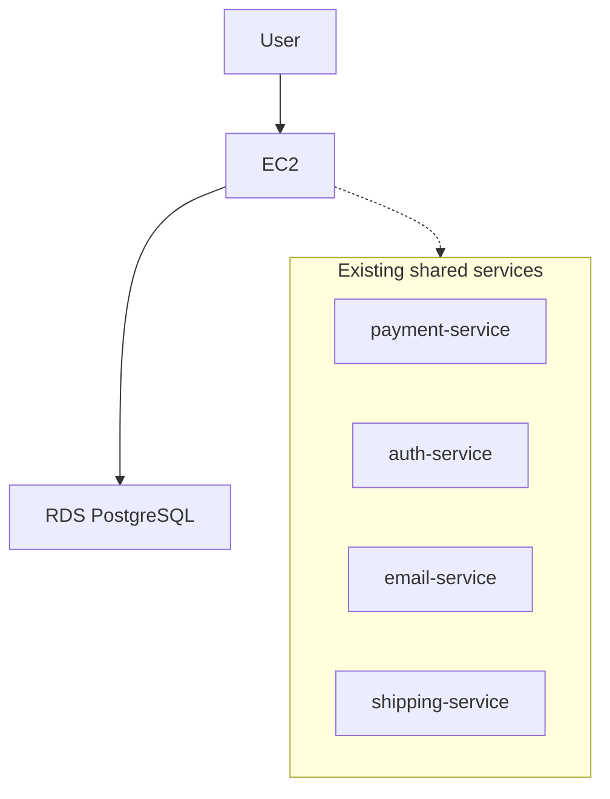
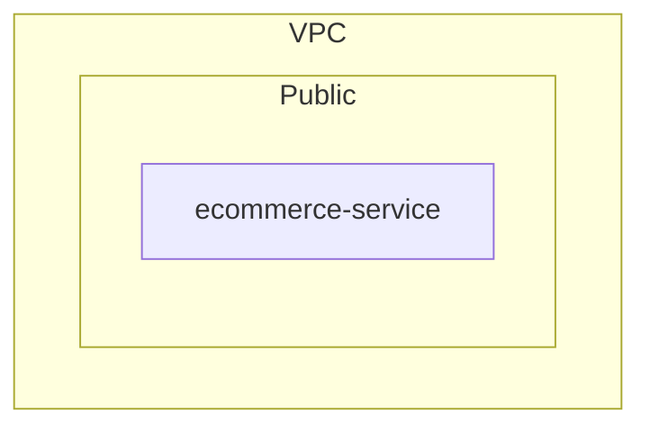
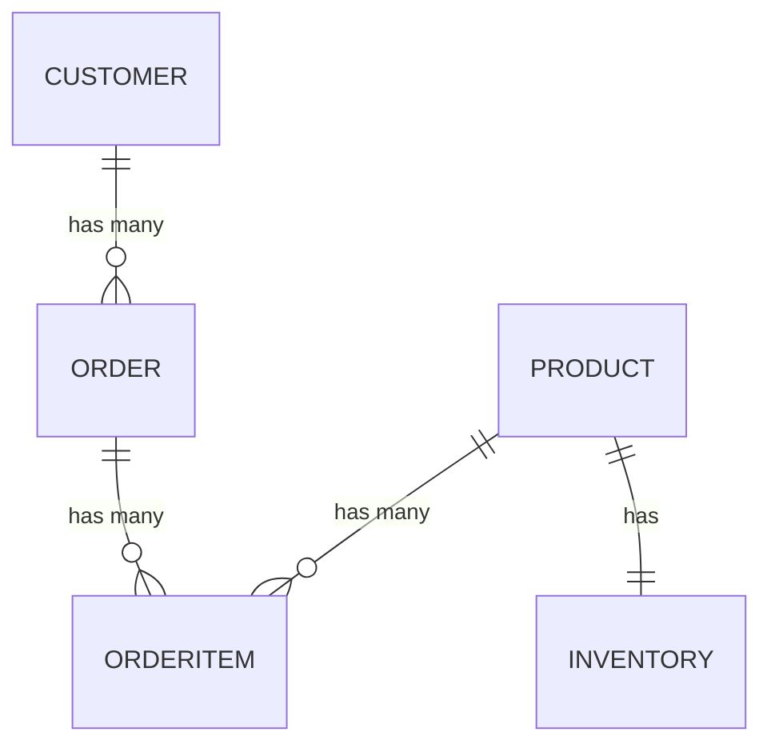
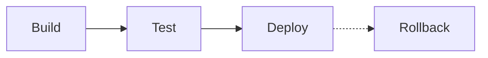

# Ecommerce Website For Electronics — Architecture & Design Specification

## Revision History

| Revision | Issue Date | Author | Comments |
| :--- | :--- | :--- | :--- |
| 1.0 | 2026-09-23 | Arcleo pipeline | Initial generated draft |

## Glossary

| Acronym | Definition |
| :--- | :--- |
| API | Application Programming Interface |
| AWS | Amazon Web Services |
| CI/CD | Continuous Integration / Continuous Deployment |
| EC2 | Elastic Compute Cloud |
| HTTP | Hypertext Transfer Protocol |
| HTTPS | HTTP Secure |
| JWT | JSON Web Token |
| PCI | Payment Card Industry |
| RDS | Relational Database Service |
| SQL | Structured Query Language |

## Purpose & Scope

The purpose of this document is to outline the architecture specifications for an e-commerce website designed for an individual seller to sell electronic items, including phones, laptops, headphones, and accessories. The website will facilitate direct online purchases and allow customers to manage their accounts efficiently.

### In-Scope
The following core features are included in the scope of this project:
- Direct online card payments through a provider like Stripe
- Inventory management with stock level tracking
- Third-party shipping service integration
- Customer account creation and guest checkout options
- Email support for customer inquiries
- Tax included in product prices

### User Segments
| User Role              | Usage Description                                                                 |
|------------------------|-----------------------------------------------------------------------------------|
| Customers              | Customers will use the website to browse electronic items, make purchases using direct online card payments, create accounts, or opt for guest checkout. They will also have access to email support for inquiries. |
| Website Administrator   | The Website Administrator will manage inventory, track stock levels, handle customer inquiries via email, and oversee the integration with third-party shipping services. |

### Scaling Targets
No specific scale target was given.

### Out-of-Scope
#### Deferred
- How to categorize electronic items on the website.

#### Explicitly Excluded
None.

## High-Level Architecture

### Overall Architecture

The architecture of the e-commerce website is designed as a **modular monolith**. This choice is driven by the scale of the application, which is intended for a single seller with a limited number of products. The expected traffic is manageable, with a peak of a few hundred concurrent users, making the complexity of a microservices architecture unnecessary. A modular monolith allows for effective management of core features within a single deployable unit while providing the flexibility for modular internal organization. This approach simplifies deployment and maintenance, with the potential for future scalability if required.

### Services

The application consists of a single service, detailed as follows:

| Service Name        | Responsibility                                                                                             |
|---------------------|------------------------------------------------------------------------------------------------------------|
| ecommerce-service    | Handles all e-commerce functionalities including product management, inventory tracking, customer account management, and order processing. It integrates with existing services for payment processing, inventory checks, shipping label generation, and email notifications. |

### Infrastructure Components

The infrastructure for the e-commerce application is built on AWS, utilizing the following components:

| Component                | Description                                                                                   |
|--------------------------|-----------------------------------------------------------------------------------------------|
| Compute Model            | EC2                                                                                           |
| Database Service         | RDS PostgreSQL                                                                                |

The application will be deployed as a single containerized unit on an EC2 instance, which simplifies both deployment and scaling processes. The RDS PostgreSQL database will support the application's data storage needs, optimized for read-heavy operations, particularly for product listings and inventory checks. Centralized monitoring and logging will be implemented to effectively track performance and user interactions.

### Reused Shared Services

The application will also leverage several existing shared services, which are already built and running:

- **payment-service**: Direct online card payments through a provider like Stripe.
- **auth-service**: Customer account creation and guest checkout options (partial).
- **email-service**: Email support for customer inquiries.
- **shipping-service**: Third-party shipping service integration (partial). 

This architecture ensures that the e-commerce website is robust, efficient, and capable of handling the expected user load while maintaining the flexibility for future enhancements.



## Reused Components

This project's needs were checked against 14 existing shared service(s): auth-service, authorization-service, email-service, slack-service, sms-service, payment-service, inventory-service, shipping-service, billing-service, analytics-service, geolocation-service, calendar-service, fraud-detection-service, identity-verification-service. Shared services are already built and running; this project calls them and does not build, deploy, or cost them.

| Need | Existing service | Fit | Capability used | Integration | Gaps this project must cover |
| :--- | :--- | :--- | :--- | :--- | :--- |
| Direct online card payments through a provider like Stripe | payment-service | full | Charge a customer's card for a one-time payment | Use POST /v1/payments/charge to process card payments. | — |
| Customer account creation and guest checkout options | auth-service | partial | User login with email and password | Use POST /v1/auth/login for customer login. | Guest checkout functionality needs to be built separately. |
| Email support for customer inquiries | email-service | full | Send a single transactional email | Use POST /v1/emails to send customer inquiry responses. | — |
| Third-party shipping service integration | shipping-service | partial | Create a shipping label | Use POST /v1/shipping/labels to generate shipping labels. | Integration logic for selecting carriers and managing shipping options needs to be built. |

**Built new (no catalog match):**

- Inventory management with stock level tracking
- Tax included in product prices

**Catalog services considered but not used:** authorization-service, slack-service, sms-service, inventory-service, billing-service, analytics-service, geolocation-service, calendar-service, fraud-detection-service, identity-verification-service

## Backend Architecture

### Service Overview

The architecture for this project is designed as a modular monolith, encapsulated within a single service, the `ecommerce-service`. This service is responsible for a range of e-commerce functionalities, which include:

- **Product Management**: Handling the addition, update, and removal of products within the catalog.
- **Inventory Tracking**: Monitoring stock levels and managing inventory for products.
- **Customer Account Management**: Facilitating customer account creation, management, and guest checkout options.
- **Order Processing**: Managing the lifecycle of customer orders from placement to fulfillment.

### Service Dependencies

The `ecommerce-service` relies on several external shared services to fulfill its responsibilities. The following table outlines these dependencies:

| Service Name        | Responsibility                                      |
|---------------------|-----------------------------------------------------|
| payment-service      | Processes direct online card payments through a provider like Stripe. |
| auth-service         | Manages customer account creation and guest checkout options. |
| email-service        | Provides email support for customer inquiries.      |
| shipping-service     | Integrates with third-party shipping services for label generation and tracking. |

### Integration with External Services

The `ecommerce-service` integrates with the above external services to enhance its functionality:

- **Payment Processing**: The service calls the `payment-service` to handle transactions securely.
- **Authentication**: It utilizes the `auth-service` for managing user accounts and ensuring secure access.
- **Email Notifications**: The `email-service` is used to send notifications and confirmations to customers regarding their orders.
- **Shipping Management**: The `shipping-service` is called upon to generate shipping labels and manage logistics for order fulfillment.

### Conclusion

This architecture allows for a streamlined approach to managing e-commerce functionalities within a single service, while leveraging existing shared services for specialized tasks. The modular monolith design provides the flexibility to scale and adapt as the needs of the application evolve, without the complexity of a microservices architecture. The service-dependency diagram below illustrates the relationships and dependencies between the `ecommerce-service` and the external services it interacts with.

## Frontend Architecture

### Frontend Stack Overview

The frontend architecture is built using the following technologies:

| Component          | Technology |
|--------------------|------------|
| Framework          | React      |
| State Management    | Redux      |

### State Management

Redux is employed for state management within the application. This choice facilitates a predictable state container, allowing for efficient management of the application's state across various components. Redux's unidirectional data flow aligns well with the React framework, ensuring that the UI remains in sync with the underlying state.

### Authentication Integration

The frontend integrates with the authentication strategy through the use of the auth-service. This service supports customer account creation and guest checkout options. The authentication flow is as follows:

1. User credentials are sent to the endpoint `POST /v1/auth/login`.
2. Upon successful authentication, a JSON Web Token (JWT) is returned.
3. This JWT is stored in memory and is utilized for subsequent API requests by attaching it as a Bearer token in the Authorization header.

The API enforces per-user data scoping on the server side using the user ID embedded within the token. The frontend's responsibility is to consistently attach the token with each request, ensuring secure and authorized access to user-specific data. 

This integration is crucial as it supports the requirements for customers to create accounts and manage their orders, thus establishing a user-facing frontend that effectively handles account management and order processing.

## Logical Architecture & Design Patterns

### Modular Monolith

The application is structured as a modular monolith, encapsulating all e-commerce functionalities within a single deployable unit while allowing for modular internal organization. This design enables the development team to maintain a cohesive codebase while still promoting separation of concerns through well-defined modules. Each module corresponds to a specific domain within the e-commerce ecosystem, such as product management, order processing, and user management. This approach simplifies deployment and scaling, as the entire application can be deployed as a single unit while still maintaining modularity in its internal structure.

### Service Integration

The ecommerce-service integrates with several external services to handle specific functionalities essential for the overall operation of the e-commerce platform. The following table outlines the key external services and their roles:

| Service Name      | Functionality Description                                      |
|-------------------|---------------------------------------------------------------|
| payment-service    | Manages payment processing and transactions for customer orders. |
| auth-service       | Handles user authentication and authorization processes.        |
| email-service      | Sends transactional and promotional emails to users.           |
| shipping-service    | Manages shipping logistics and tracking for customer orders.   |

This integration allows the ecommerce-service to leverage specialized functionalities without needing to implement them from scratch, thereby enhancing the overall efficiency and maintainability of the application.

## Cloud Infrastructure & Cost

### Cloud Provider

The cloud infrastructure for this project is provisioned on Amazon Web Services (AWS). This choice is based on AWS's robust offerings and reliability, which are well-suited for the expected load and operational requirements of the application.

### Compute Infrastructure

The compute model selected for this project is based on Amazon EC2. Specifically, a `t3.medium` instance will be utilized, which provides 2 vCPUs and 4 GiB of memory. This instance type is appropriate for the expected maximum of 500 concurrent users, particularly during peak traffic events such as sales.

### Database Service

For the database service, Amazon RDS with PostgreSQL is chosen. The instance type will be `db.t3.micro`, which offers 1 vCPU and 1 GiB of memory. This configuration is sufficient given the application's needs, which involve a single seller with a limited product catalog.

### Cache, Messaging, and CDN

No caching, messaging, or content delivery network (CDN) services have been provisioned for this project. The decision to omit these components is based on the anticipated low complexity and manageable traffic of the application, which does not warrant the additional overhead of these services at this stage.

### Sizing and Estimated Costs

The following table summarizes the sizing and estimated monthly costs for the cloud infrastructure:

| Component            | Specification           | Monthly Cost   | Confidence Level |
|----------------------|-------------------------|----------------|------------------|
| EC2 Instance         | t3.medium, 2 vCPU / 4 GiB | $30 - $40      | High             |
| RDS PostgreSQL       | db.t3.micro, 1 vCPU / 1 GiB | $15 - $20      | High             |

### Total Estimated Monthly Cost

The total estimated monthly cost for the cloud infrastructure is projected to be between $45 and $60, with a high level of confidence in this estimate. This cost reflects the small-scale infrastructure necessary for the e-commerce website, which is designed for a single seller and manageable traffic. 

### Reused Shared Services

This project will also leverage several existing shared services, which are already built and running. These services include:

- **payment-service**: Full integration for direct online card payments through a provider like Stripe.
- **auth-service**: Partial integration for customer account creation and guest checkout options.
- **email-service**: Full support for customer inquiries via email.
- **shipping-service**: Partial integration with a third-party shipping service.

For details on these reused components, please refer to the 'Reused Components' section.

## Infrastructure Connectivity

### Network Topology

The network topology for this project consists of a single subnet tier, designated as the "Public" tier. This tier is specifically designed to host the `ecommerce-service`, which is essential for direct customer interactions. The decision to utilize a single subnet tier is based on the infrastructure requirements, which include only one EC2 instance for the `ecommerce-service` and one RDS instance for PostgreSQL. Given that the database is not directly exposed to the internet, and the `ecommerce-service` can manage all necessary functionalities, a separate private tier is deemed unnecessary. This approach simplifies the network architecture while still meeting the application's needs.

#### Subnet Tier Details

| Subnet Tier | Purpose                                                                 | Contains          |
|-------------|-------------------------------------------------------------------------|-------------------|
| Public      | Hosts the `ecommerce-service` which needs to be directly reachable for customer interactions. | ecommerce-service  |

### Security Group Rules

The security group rules for the Public subnet are configured to ensure secure access and communication. The following rules are in place:

| Direction | Protocol | Port | Source/Destination         | Description                                   |
|-----------|----------|------|----------------------------|-----------------------------------------------|
| Inbound   | TCP      | 80   | 0.0.0.0/0                  | Allow HTTP traffic from any source           |
| Inbound   | TCP      | 443  | 0.0.0.0/0                  | Allow HTTPS traffic from any source          |
| Outbound  | TCP      | 443  | payment-service             | Allow HTTPS traffic to payment-service       |
| Outbound  | TCP      | 443  | auth-service                | Allow HTTPS traffic to auth-service          |
| Outbound  | TCP      | 443  | email-service               | Allow HTTPS traffic to email-service         |
| Outbound  | TCP      | 443  | shipping-service            | Allow HTTPS traffic to shipping-service      |

### External Connectivity

The `ecommerce-service` establishes outbound HTTPS connections to several external services to facilitate various functionalities:

| External Service   | Purpose                                      |
|--------------------|----------------------------------------------|
| payment-service     | Processing online card payments              |
| auth-service        | Customer login and account management        |
| email-service       | Sending transactional emails                 |
| shipping-service    | Generating shipping labels                   |

This configuration aligns with best practices for a single-instance application, ensuring that the necessary services are accessible while maintaining a straightforward network topology. For further details on the reused shared services, please refer to the 'Reused Components' section.



## API Server Details

### Deployment Mechanics

The deployment of the application is structured around a continuous integration and continuous deployment (CI/CD) pipeline, which consists of three primary stages: Build, Test, and Deploy. The details of each stage are outlined below:

| Stage  | Description                                                   |
|--------|-------------------------------------------------------------|
| Build  | Compile the application code and package it for deployment. |
| Test   | Run unit tests and integration tests to ensure code quality and functionality. |
| Deploy | Deploy the application to the production environment on the EC2 instance. |

### Autoscaling Policy

Currently, the project's scale does not call for an autoscaling policy. The application is hosted on a single EC2 instance, and given the limited number of products and manageable traffic associated with the e-commerce website, the complexity of autoscaling is unnecessary at this time.

### Health Check Configuration

To ensure the application remains operational, a health check mechanism is implemented. The health check is configured as follows:

- **Endpoint**: `HTTP GET /health`
- **Purpose**: This endpoint is used to check the application status, allowing for monitoring and ensuring that the service is running as expected.

### Rollback Strategy

In the event of a deployment failure, the rollback strategy is straightforward. The previous build will be redeployed to restore the application to a stable state. This approach provides a reliable method for handling deployment issues without introducing unnecessary complexity.

### Deployment Frequency

Deployments will occur as needed, typically following the successful completion of new features or bug fixes. This flexible deployment frequency allows for timely updates while maintaining application stability.

### Summary

Given the current scale of the e-commerce website, which is designed for a single seller with a limited product range, the deployment strategy focuses on simplicity and effectiveness. The use of a single EC2 instance, combined with a straightforward CI/CD pipeline, ensures that the application can be managed efficiently without the need for advanced deployment strategies such as canary or blue-green deployments.

## Data Model

### Product Management

#### Entities

**Product**

| Column Name   | Type     | Constraints                                   |
|---------------|----------|-----------------------------------------------|
| id            | integer  | PRIMARY KEY, AUTOINCREMENT                    |
| name          | string   | NOT NULL                                      |
| description   | string   |                                               |
| price         | decimal  | NOT NULL                                      |
| sku           | string   | UNIQUE, NOT NULL                              |
| category      | string   |                                               |
| image_url     | string   |                                               |
| created_at    | datetime | DEFAULT CURRENT_TIMESTAMP                      |
| updated_at    | datetime | DEFAULT CURRENT_TIMESTAMP, ON UPDATE CURRENT_TIMESTAMP |

**Relationships:**
- Each product has a corresponding inventory record (one-to-one relationship with Inventory).
- A product can be part of multiple order items (one-to-many relationship with OrderItem).

### Inventory Management

#### Entities

**Inventory**

| Column Name   | Type     | Constraints                                   |
|---------------|----------|-----------------------------------------------|
| product_id    | integer  | PRIMARY KEY, NOT NULL, FOREIGN KEY REFERENCES Product(id) |
| stock_level    | integer  | NOT NULL                                      |
| restock_date   | datetime |                                               |

**Relationships:**
- Each product has a corresponding inventory record (one-to-one relationship with Product).

### User Management

#### Entities

**Customer**

| Column Name   | Type     | Constraints                                   |
|---------------|----------|-----------------------------------------------|
| id            | integer  | PRIMARY KEY, AUTOINCREMENT                    |
| email         | string   | UNIQUE, NOT NULL, ENCRYPTED                   |
| first_name    | string   | NOT NULL                                      |
| last_name     | string   | NOT NULL                                      |
| created_at    | datetime | DEFAULT CURRENT_TIMESTAMP                      |
| updated_at    | datetime | DEFAULT CURRENT_TIMESTAMP, ON UPDATE CURRENT_TIMESTAMP |

**Relationships:**
- A customer can have multiple orders (one-to-many relationship with Order).
- A customer can send multiple email support requests (one-to-many relationship with EmailSupport).

### Order Processing

#### Entities

**Order**

| Column Name       | Type     | Constraints                                   |
|-------------------|----------|-----------------------------------------------|
| id                | integer  | PRIMARY KEY, AUTOINCREMENT                    |
| customer_id       | integer  | NOT NULL, FOREIGN KEY REFERENCES Customer(id) |
| order_date        | datetime | DEFAULT CURRENT_TIMESTAMP                      |
| total_amount      | decimal  | NOT NULL                                      |
| status            | string   |                                               |
| shipping_address   | string   | ENCRYPTED                                     |
| payment_status     | string   |                                               |

**Relationships:**
- An order can contain multiple order items (one-to-many relationship with OrderItem).
- An order can have one payment record (one-to-one relationship with Payment).
- An order can have one shipping record (one-to-one relationship with Shipping).

**OrderItem**

| Column Name   | Type     | Constraints                                   |
|---------------|----------|-----------------------------------------------|
| id            | integer  | PRIMARY KEY, AUTOINCREMENT                    |
| order_id      | integer  | NOT NULL, FOREIGN KEY REFERENCES Order(id)    |
| product_id    | integer  | NOT NULL, FOREIGN KEY REFERENCES Product(id)  |
| quantity      | integer  | NOT NULL                                      |
| price         | decimal  | NOT NULL                                      |

**Relationships:**
- A product can be part of multiple order items (one-to-many relationship with Product).

**Payment**

| Column Name       | Type     | Constraints                                   |
|-------------------|----------|-----------------------------------------------|
| id                | integer  | PRIMARY KEY, AUTOINCREMENT                    |
| order_id          | integer  | NOT NULL, FOREIGN KEY REFERENCES Order(id)    |
| payment_provider   | string   | NOT NULL                                      |
| amount            | decimal  | NOT NULL                                      |
| payment_date      | datetime | DEFAULT CURRENT_TIMESTAMP                      |
| status            | string   |                                               |

**Shipping**

| Column Name       | Type     | Constraints                                   |
|-------------------|----------|-----------------------------------------------|
| id                | integer  | PRIMARY KEY, AUTOINCREMENT                    |
| order_id          | integer  | NOT NULL, FOREIGN KEY REFERENCES Order(id)    |
| shipping_service   | string   | NOT NULL                                      |
| tracking_number    | string   |                                               |
| shipping_date      | datetime |                                               |

### Support Management

#### Entities

**EmailSupport**

| Column Name   | Type     | Constraints                                   |
|---------------|----------|-----------------------------------------------|
| id            | integer  | PRIMARY KEY, AUTOINCREMENT                    |
| customer_id   | integer  | NOT NULL, FOREIGN KEY REFERENCES Customer(id) |
| subject       | string   | NOT NULL                                      |
| message       | string   | NOT NULL                                      |
| created_at    | datetime | DEFAULT CURRENT_TIMESTAMP                      |

**Relationships:**
- A customer can send multiple email support requests (one-to-many relationship with Customer).

The above entities and their relationships are visually represented in the accompanying Entity-Relationship Diagram (ERD).



## API Contract

| Method | Path                     | Description                                                                                                                                                       |
|--------|--------------------------|-------------------------------------------------------------------------------------------------------------------------------------------------------------------|
| POST   | /v1/products             | Creates a new product listing. Requires an authenticated request; only accessible by users with 'manage' permission on products.                                |
| GET    | /v1/products/{id}       | Retrieves a specific product by ID. Requires an authenticated request; accessible to all users.                                                                  |
| PUT    | /v1/products/{id}       | Updates an existing product listing. Requires an authenticated request; only accessible by users with 'manage' permission on products.                          |
| DELETE | /v1/products/{id}       | Deletes a product listing. Requires an authenticated request; only accessible by users with 'manage' permission on products.                                    |
| GET    | /v1/inventory/{sku}     | Checks the current stock level of a product by SKU. Accessible to all users.                                                                                    |
| POST   | /v1/inventory/update     | Updates the stock level for a product. Requires an authenticated request; only accessible by users with 'manage' permission on inventory.                      |
| POST   | /v1/customers           | Creates a new customer account. Accessible to all users.                                                                                                        |
| GET    | /v1/customers/{id}      | Retrieves a specific customer account by ID. Requires an authenticated request; only returns the record if it matches the authenticated user's ID.              |
| PUT    | /v1/customers/{id}      | Updates a customer account. Requires an authenticated request; only returns the record if it matches the authenticated user's ID.                               |
| POST   | /v1/orders              | Creates a new order. Requires an authenticated request; only accessible by users with 'manage' permission on orders.                                           |
| GET    | /v1/orders/{id}         | Retrieves a specific order by ID. Requires an authenticated request; only returns the record if it matches the authenticated user's ID.                        |
| PUT    | /v1/orders/{id}         | Updates an existing order. Requires an authenticated request; only returns the record if it matches the authenticated user's ID.                               |
| DELETE | /v1/orders/{id}         | Deletes an order. Requires an authenticated request; only returns the record if it matches the authenticated user's ID.                                         |
| POST   | /v1/orders/{id}/items   | Adds an item to an order. Requires an authenticated request; only accessible by users with 'manage' permission on orders.                                      |
| GET    | /v1/orders/{id}/items   | Retrieves all items in a specific order. Requires an authenticated request; only returns the items if it matches the authenticated user's ID.                  |

## Authorization & Security

### Authentication Strategy

The authentication strategy for this system utilizes the `auth-service` for customer account creation and guest checkout options. It is important to note that the guest checkout functionality will need to be developed separately to ensure a seamless user experience.

### Authorization Rules

The following authorization rules govern access to resources within the system:

| Actor                   | Resource | Action | Scope | Scope Note |
|-------------------------|----------|--------|-------|------------|
| Customer                | Order    | view   | own   |            |
| Customer                | Order    | create | own   |            |
| Customer                | Customer | update | own   |            |
| Website Administrator    | Customer | manage | all   |            |

### Data Protection Measures

To safeguard sensitive information, the following data protection measures have been implemented:

| Sensitive Field                        | Protection Method                                      |
|----------------------------------------|-------------------------------------------------------|
| Customer.email                         | Encrypted                                             |
| Order.shipping_address                 | Encrypted                                             |
| Payment.amount, Payment.payment_provider| Protected by PCI DSS compliance measures               |

The system is designed to mitigate threats such as data breaches due to unauthorized access to customer accounts, fraudulent transactions through compromised payment information, and denial of service attacks affecting website availability. The handling of sensitive data, specifically customer email addresses and payment information, necessitates compliance with data protection regulations.

### Tenant/Data Isolation Summary

The isolation of tenant data is achieved across multiple layers:

- **Database Layer**: The database uses a schema that scopes data to individual customers, ensuring that sensitive information is only accessible to authorized users.
  
- **Application Layer**: The authorization rules restrict customer access to their own orders and account information, while allowing the Website Administrator to manage all customer accounts.

- **Network Layer**: The application is hosted in a single public subnet, which allows inbound traffic on ports 80 (HTTP) and 443 (HTTPS) for customer interactions. Outbound traffic is permitted to the `payment-service`, `auth-service`, `email-service`, and `shipping-service` over HTTPS, ensuring secure communication with these external dependencies.

This layered approach to isolation ensures that sensitive data remains protected while allowing necessary interactions for functionality.

```mermaid
sequenceDiagram
    actor User
    participant App
    participant Auth as Authentication
    participant DB as Database
    Note over User,DB: auth-service (partial) for customer account creation and guest checkout options; guest checkout functionality needs to be built separately.
    User->>App: Submit credentials
    App->>Auth: Validate credentials
    Auth->>DB: Look up user/session
    DB-->>Auth: User record
    Auth-->>App: Auth result (token/session)
    App-->>User: Authenticated response
```

## Quality Attributes

### Quality Attributes Matrix

| Attribute      | Description                                                                                                                                                       |
|----------------|-------------------------------------------------------------------------------------------------------------------------------------------------------------------|
| Security       | Sensitive data such as customer email and payment information is encrypted, and PCI DSS compliance measures are implemented for payment processing.              |
| Performance    | Database queries are optimized for read-heavy operations, particularly for product listings and inventory checks, ensuring quick response times for users.      |
| Availability    | The application is deployed as a single containerized unit on an EC2 instance, which does not support autoscaling, potentially leading to downtime during peak traffic. |
| Reliability    | The application relies on a single EC2 instance without Multi-AZ failover, which increases the risk of downtime if the instance fails.                          |
| Recoverability  | The rollback strategy involves redeploying the previous build if a new deployment fails, which may not be sufficient for quick recovery in case of critical issues. |
| Maintainability | The modular monolith architecture allows for easier maintenance and future scalability, but the lack of a microservices approach may complicate updates to individual components. |

## CI/CD & Deployment

### CI/CD Pipeline

The CI/CD pipeline for this project consists of three primary stages, which are outlined in the table below. This pipeline is designed to ensure efficient and reliable deployment of the application, given its scale and requirements.

| Stage  | Description                                                       |
|--------|-------------------------------------------------------------------|
| Build  | Compile the application code and package it for deployment.       |
| Test   | Run unit tests and integration tests to ensure code quality and functionality. |
| Deploy | Deploy the application to the production environment on the EC2 instance. |

The deployment frequency is determined to be "as needed," typically occurring after the successful completion of features or bug fixes. This approach allows for timely updates while maintaining the integrity of the application.

### Rollback Strategy

In the event of a deployment failure, the rollback strategy is straightforward: the previous build will be redeployed. This method provides a reliable means of reverting to a stable state without introducing unnecessary complexity into the deployment process.

### Health Check

To ensure the application is functioning correctly after deployment, a health check will be performed using the following endpoint:

- **HTTP GET /health**: This endpoint will return the application status, allowing for quick verification of operational readiness.

### Reused Shared Services

This project relies on several existing shared services that are already built and operational. These services are external dependencies and are not part of the deployment pipeline. For details on these services, please refer to the 'Reused Components' section. The shared services include:

- **payment-service**: Direct online card payments through a provider like Stripe.
- **auth-service**: Customer account creation and guest checkout options.
- **email-service**: Email support for customer inquiries.
- **shipping-service**: Third-party shipping service integration.

This CI/CD pipeline is designed to be simple and effective, aligning with the project's needs and the manageable scale of the e-commerce website. The accompanying pipeline diagram provides a visual representation of these stages and their flow.



## Security, Compliance & Risks

| Risk                                                                                                     | Severity | Mitigation                                                                                                 |
|----------------------------------------------------------------------------------------------------------|----------|------------------------------------------------------------------------------------------------------------|
| Single point of failure due to reliance on a single EC2 instance without autoscaling or failover mechanisms. | high     | Consider implementing a Multi-AZ deployment or at least a backup instance to reduce downtime risk.         |
| Potential downtime during peak traffic due to lack of autoscaling.                                       | high     | Monitor traffic patterns and consider implementing autoscaling in the future as traffic grows.            |
| Dependency on external services (payment-service, auth-service, email-service, shipping-service) creates availability coupling; if any of these services are down, the e-commerce functionality will be impacted. | high     | Implement fallback mechanisms or user notifications for service outages.                                   |
| Changes in the API contracts of shared services could break functionality without notice, as these are managed by other teams. | medium   | Establish communication channels with the teams managing these services to stay informed about changes.    |
| Limited guest checkout functionality due to the need for separate implementation, which could impact user experience. | medium   | Prioritize the development of guest checkout functionality to enhance user experience.                     |
| Data breaches due to unauthorized access to customer accounts, particularly with the reliance on the auth-service for account management. | high     | Implement additional security measures such as rate limiting and monitoring for suspicious activity.       |

### Compliance Notes
- Customer email addresses require encryption at rest — addressed by the use of RDS PostgreSQL's encryption features.
- Payment information must comply with PCI DSS — addressed by implementing PCI DSS compliance measures for payment processing.
- Shipping addresses are sensitive data and must be encrypted — addressed by marking the shipping_address field in the Order schema as ENCRYPTED.

## Assumptions & Open Questions

### Assumptions

| Assumption                                                                 |
|---------------------------------------------------------------------------|
| The website will not support multiple sellers or a marketplace model.     |

### Open Questions

| Open Question                                                            |
|-------------------------------------------------------------------------|
| How do you plan to categorize your electronic items on the website?     |

## References

Full agent reasoning trail (intake Q&A, branch-by-branch decisions, reconciliation history): `arcleo_project_ecommerce_website_for_electronics.md` in this project's living record.
